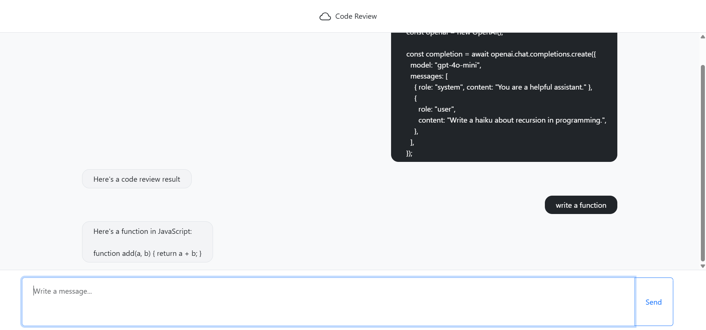

# Code Review

Frontend for Code Review app with AI-assistant

## Stack
- Node.js v22
- React v19
- Bootstrap 5
- Webpack
- ESlint

## Setup
Download a project.

Change directory to `code-review`.

Run the command: `make install`.

## Development
```bash
make develop
```
On localhost:9000

## Description
- When you click on the cloud in the header the chat will be cleared.
- The message will be send when you click the send button or when you focus on the input field and press enter.

## The example of work
